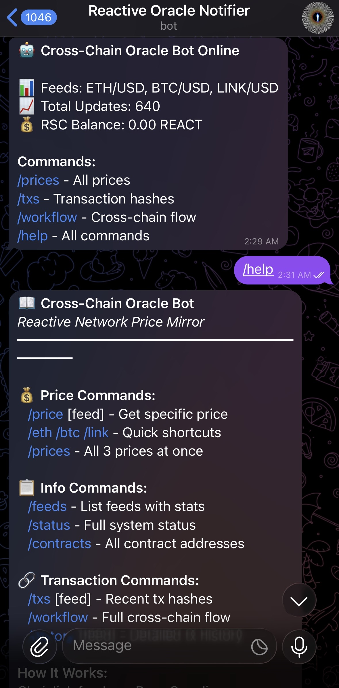
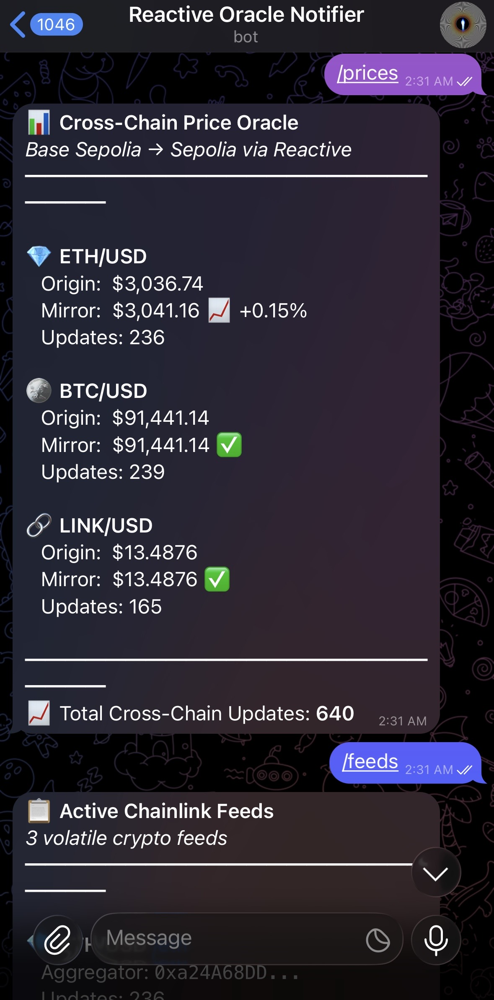
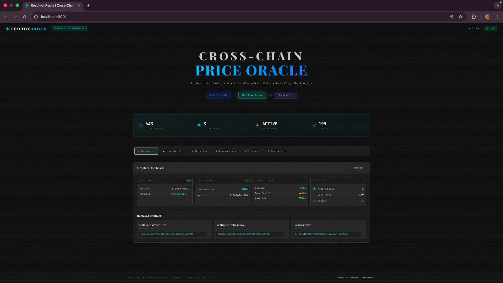
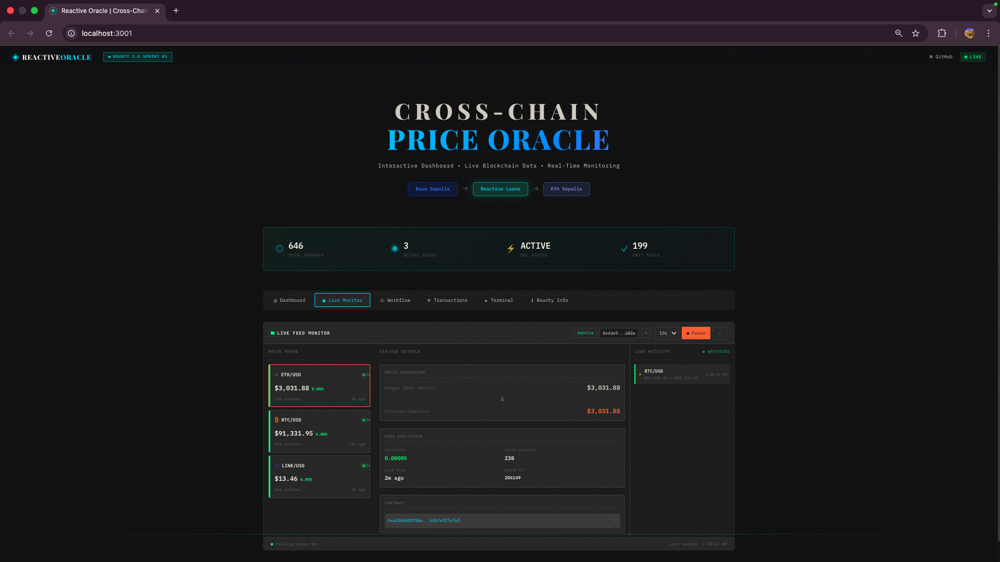
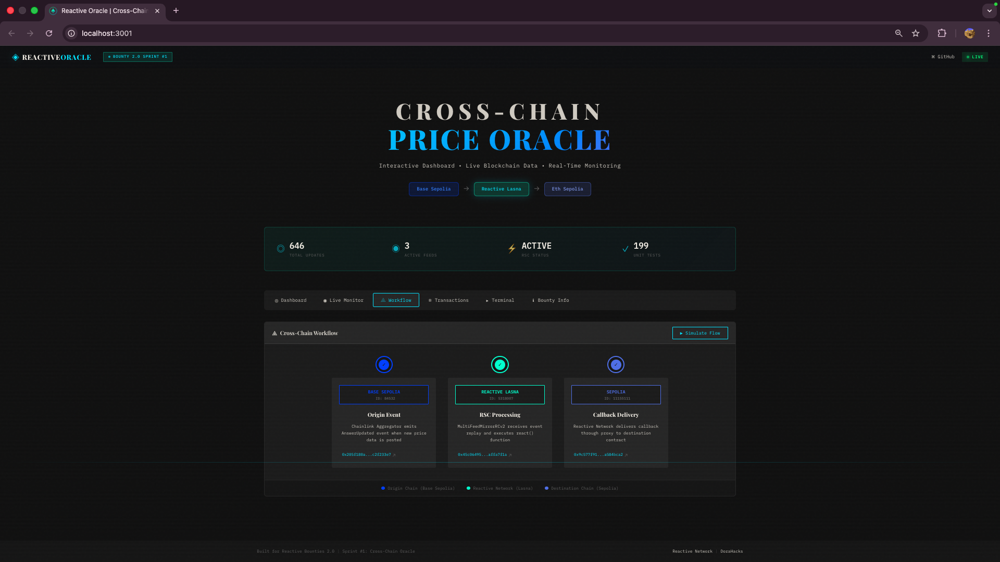
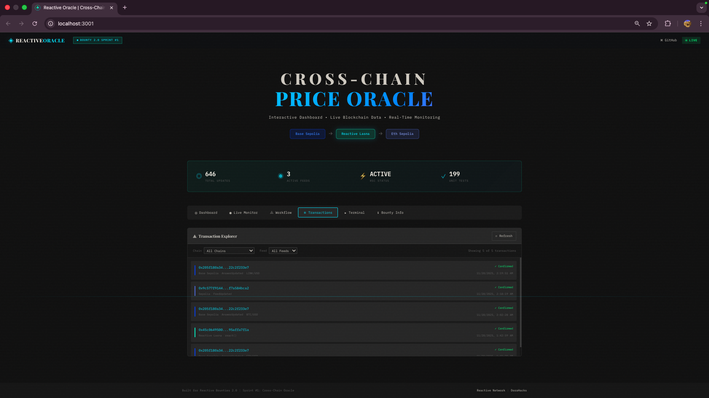
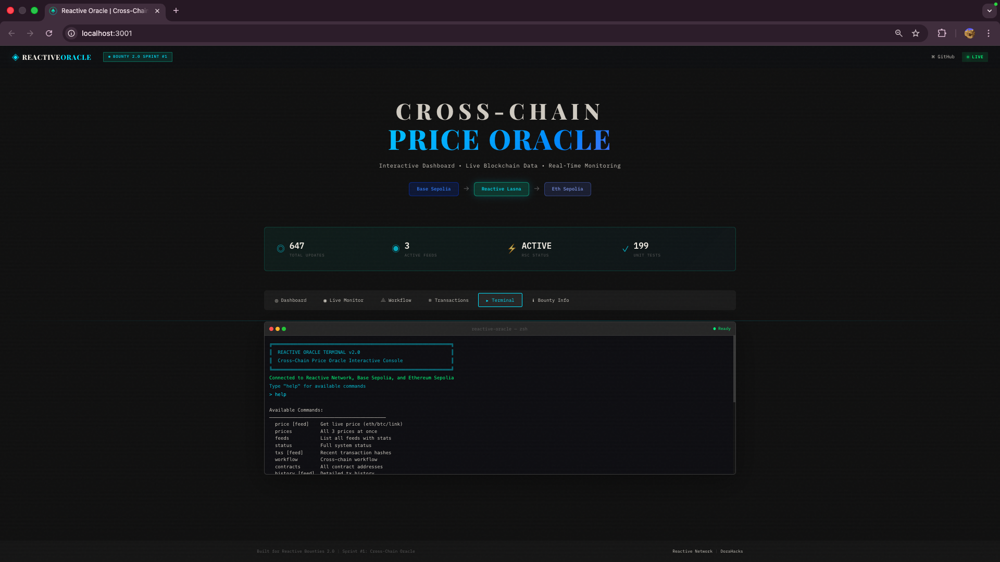
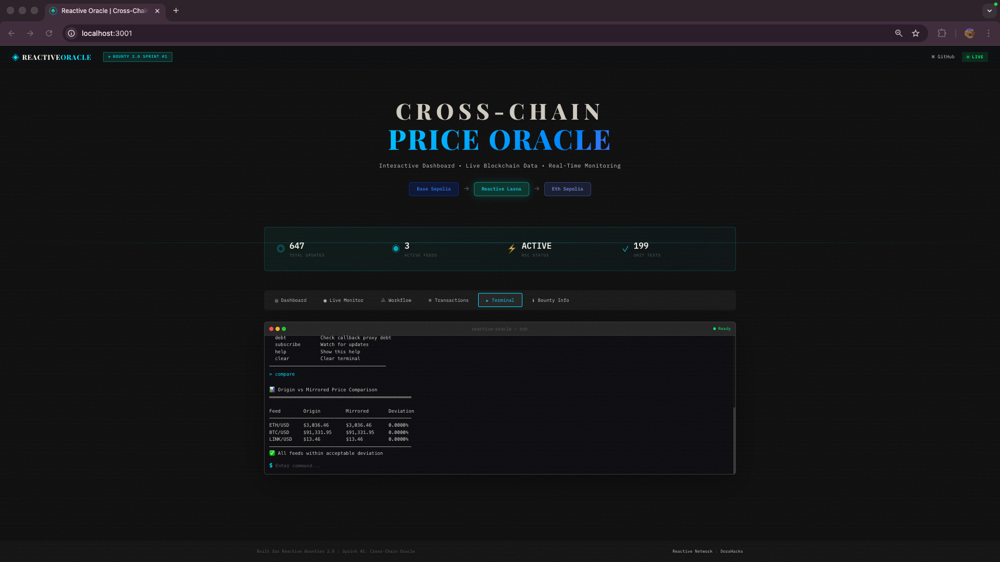

# Reactive Cross-Chain Multi-Feed Price Oracle

## Bounty Submission: Sprint #1 - Cross-Chain Oracle

A production-grade, autonomous cross-chain oracle that mirrors **multiple Chainlink price feeds** from **Base Sepolia** to **Ethereum Sepolia** using Reactive Network contracts. Features a Telegram bot for live monitoring and transaction tracking.

**Deadline:** November 30, 2025  
**Status:** ✅ **FULLY OPERATIONAL**  
**Total Updates:** 1,542 cross-chain callbacks delivered  
**Last Verified:** December 2, 2025 at 19:12 UTC

---

## 🎬 Demo Video

[](https://youtu.be/Fz7K0ocbgEU)

**[▶️ Watch the Full Demo on YouTube](https://youtu.be/Fz7K0ocbgEU)** (4:56)

---

## 🎯 Deployed Contracts (Production - Multi-Feed)

| Component | Network | Chain ID | Address |
|-----------|---------|----------|---------|
| **MultiFeedDestinationV2** | Sepolia | 11155111 | [`0x889c32f46E273fBd0d5B1806F3f1286010cD73B3`](https://sepolia.etherscan.io/address/0x889c32f46E273fBd0d5B1806F3f1286010cD73B3) |
| **MultiFeedMirrorRCv2** | Reactive Lasna | 5318007 | [`0x70c6c95D4F75eE019Fa2c163519263a11AaC70f5`](https://reactscan.net/address/0x70c6c95D4F75eE019Fa2c163519263a11AaC70f5) |
| **Callback Proxy** | Sepolia | 11155111 | `0xc9f36411C9897e7F959D99ffca2a0Ba7ee0D7bDA` |

### Supported Price Feeds (Base Sepolia → Sepolia)

| Feed | Origin Aggregator (Base Sepolia) | Decimals |
|------|----------------------------------|----------|
| **ETH/USD** | `0xa24A68DD788e1D7eb4CA517765CFb2b7e217e7a3` | 8 |
| **BTC/USD** | `0x961AD289351459A45fC90884eF3AB0278ea95DDE` | 8 |
| **LINK/USD** | `0xAc6DB6d5538Cd07f58afee9dA736ce192119017B` | 8 |

---

## 🤖 Telegram Bot (Live Monitoring)

Monitor the oracle in real-time via Telegram bot with **Auto-Refill Support**. **[📖 Full Documentation](docs/TELEGRAM_BOT.md)**

### Quick Start
```bash
# Set environment variables
export TELEGRAM_BOT_TOKEN=your_token_from_botfather
export TELEGRAM_CHAT_ID=your_chat_id

# Start the bot (with auto-refill)
npm run bot:autorefill

# Or start the basic bot (without auto-refill)
npm run bot
```

### Available Commands
| Command | Description | Sample Response |
|---------|-------------|-----------------|
| `/prices` | Get all 3 feed prices | ETH: $3,041 • BTC: $91,441 • LINK: $13.49 |
| `/eth` | ETH/USD price + stats | Price, round ID, update count, age |
| `/btc` | BTC/USD price + stats | Price, round ID, update count, age |
| `/link` | LINK/USD price + stats | Price, round ID, update count, age |
| `/status` | Full system status | Networks, balances, all feed stats |
| `/balance` | Check wallet & RSC balances | SepETH, REACT, RSC status |
| `/refill` | Manual RSC refill | Fund RSCs and cover debt |
| `/autorefill` | Toggle auto-refill on/off | Enable/disable automatic funding |
| `/txs` | Recent transaction hashes | Origin, Reactive, Destination tx links |
| `/workflow` | Cross-chain flow diagram | Step-by-step with contract addresses |
| `/contracts` | All deployed addresses | RSC, Destination, Aggregators |
| `/help` | List all commands | Full command reference |

### Bot Screenshots

| All Prices | Cross-Chain Workflow |
|------------|---------------------|
|  |  |
| `/prices` - Live ETH, BTC, LINK prices | `/workflow` - Full cross-chain flow |

---

## 🖥️ Live Dashboard (Frontend)

A real-time web dashboard for monitoring the oracle system:

```bash
cd frontend
npm install
npm run dev
```

Open http://localhost:3001 to view:
- **Live Price Feeds**: Origin vs mirrored prices with deviation tracking
- **Cross-Chain Workflow**: Visual transaction flow with explorer links
- **Transaction Explorer**: All cross-chain transactions with status
- **Interactive Terminal**: Query prices and system status **[📖 Full Documentation](docs/INTERACTIVE_TERMINAL.md)**
- **System Stats**: Total updates, RSC status, network latencies

### Dashboard Screenshots

#### System Dashboard

*Main dashboard showing 647 total updates, 3 active feeds, network latencies, and deployed contracts*

#### Live Feed Monitor

*Real-time price monitoring with ETH/USD $3,031.88, BTC/USD $91,331.95, LINK/USD $13.46*

#### Cross-Chain Workflow

*Visual representation of the 3-step cross-chain flow: Base Sepolia → Reactive Lasna → Ethereum Sepolia*

#### Transaction Explorer

*Live transaction feed showing origin events, reactive processing, and destination callbacks*

#### Interactive Terminal

*Built-in terminal with commands: price, feeds, status, txs, workflow, contracts. **[📖 Full Documentation](docs/INTERACTIVE_TERMINAL.md)***

#### Price Comparison

*Origin vs Mirrored price comparison showing 0.0000% deviation - perfect sync!*

---

## 🔄 How It Works (Cross-Chain Workflow)

### Step 1: Origin Event (Base Sepolia)
Chainlink's price aggregators emit `AnswerUpdated` events whenever prices change.

```
Chainlink ETH/USD: 0xa24A68DD788e1D7eb4CA517765CFb2b7e217e7a3
Event: AnswerUpdated(int256 current, uint256 roundId, uint256 updatedAt)
```

### Step 2: Reactive Processing (Lasna - Chain 5318007)
The RSC (Reactive Smart Contract) subscribes to these events and autonomously:
1. Validates incoming price data
2. Checks for duplicate rounds (deduplication via `lastRoundId`)
3. Constructs callback payload with feed identifier, decimals, and version
4. Emits a `Callback` event to the destination chain

```
RSC: 0x70c6c95D4F75eE019Fa2c163519263a11AaC70f5
```

### Step 3: Destination Update (Ethereum Sepolia)
The Callback Proxy delivers the callback to the Destination contract, which:
1. Validates sender (Callback Proxy only)
2. Validates RVM ID (authorized RSC only)
3. Validates feed source and decimals
4. Stores price data with monotonicity enforcement
5. Emits `FeedUpdated` event

### Result
Applications on Sepolia read prices via standard `AggregatorV3Interface`:

```solidity
IMultiFeedDestination dest = IMultiFeedDestination(0x889c32f46E273fBd0d5B1806F3f1286010cD73B3);
(, int256 answer, , uint256 updatedAt, ) = dest.latestRoundDataForFeed(ETH_USD_FEED);
// answer = 289412140000 ($2,894.12 with 8 decimals)
```

---

## 📊 Sample Transaction Hashes

### Origin Transactions (Base Sepolia)
| Transaction | Feed |
|-------------|------|
| [`0x205f180a3479e3a48b8de09e33fb0a171915add491d8406efa96c922c2f233e7`](https://sepolia.basescan.org/tx/0x205f180a3479e3a48b8de09e33fb0a171915add491d8406efa96c922c2f233e7) | ETH/USD |

### Reactive Transactions (Lasna)
| Transaction |
|-------------|
| [`0x45c0649500f14746e151e32cbe0576ffdd122d24493b4237fcaf1495affa7f1a`](https://reactscan.net/tx/0x45c0649500f14746e151e32cbe0576ffdd122d24493b4237fcaf1495affa7f1a) |
| [`0x17d81f88a37acb239f38b98afd8b8f6b1e5e4e40f0e9cadf41e69b9e95a0cf87`](https://reactscan.net/tx/0x17d81f88a37acb239f38b98afd8b8f6b1e5e4e40f0e9cadf41e69b9e95a0cf87) |

### Destination Transactions (Sepolia)
| Transaction | Description |
|-------------|-------------|
| [`0x9c577f914488f66795323b89d01f4c6c5bcc65922d3c85c16c98acf7a584bca2`](https://sepolia.etherscan.io/tx/0x9c577f914488f66795323b89d01f4c6c5bcc65922d3c85c16c98acf7a584bca2) | FeedUpdated callback |

---

## 🏗️ Architecture

```
┌─────────────────────────────────────────────────────────────────────────────┐
│                           BASE SEPOLIA (Chain 84532)                         │
│  ┌────────────────────────────────────────────────────────────────────────┐ │
│  │  Chainlink Price Aggregators                                           │ │
│  │  • ETH/USD: 0xa24A68DD788e1D7eb4CA517765CFb2b7e217e7a3                │ │
│  │  • BTC/USD: 0x961AD289351459A45fC90884eF3AB0278ea95DDE                │ │
│  │  • LINK/USD: 0xAc6DB6d5538Cd07f58afee9dA736ce192119017B               │ │
│  │  Emits: AnswerUpdated(int256, uint256, uint256)                        │ │
│  └────────────────────────────────────────────────────────────────────────┘ │
└─────────────────────────────────────────────────────────────────────────────┘
                                      │
                                      │ Event Subscription (3 feeds)
                                      ▼
┌─────────────────────────────────────────────────────────────────────────────┐
│                         REACTIVE LASNA (Chain 5318007)                       │
│  ┌────────────────────────────────────────────────────────────────────────┐ │
│  │  MultiFeedMirrorRCv2 (RSC)                                             │ │
│  │  0x70c6c95D4F75eE019Fa2c163519263a11AaC70f5                            │ │
│  │                                                                        │ │
│  │  • Subscribes to multiple AnswerUpdated events                         │ │
│  │  • Validates and deduplicates per-feed round data                      │ │
│  │  • DOMAIN_SEPARATOR + MESSAGE_VERSION (EIP-712 style)                  │ │
│  │  • Emits Callback event to destination                                 │ │
│  └────────────────────────────────────────────────────────────────────────┘ │
└─────────────────────────────────────────────────────────────────────────────┘
                                      │
                                      │ Callback Event
                                      ▼
┌─────────────────────────────────────────────────────────────────────────────┐
│                       ETHEREUM SEPOLIA (Chain 11155111)                      │
│  ┌────────────────────────────────────────────────────────────────────────┐ │
│  │  Callback Proxy: 0xc9f36411C9897e7F959D99ffca2a0Ba7ee0D7bDA            │ │
│  └────────────────────────────────────────────────────────────────────────┘ │
│                                      │                                       │
│                                      ▼                                       │
│  ┌────────────────────────────────────────────────────────────────────────┐ │
│  │  MultiFeedDestinationV2                                                │ │
│  │  0x889c32f46E273fBd0d5B1806F3f1286010cD73B3                            │ │
│  │                                                                        │ │
│  │  • Stores prices for multiple feeds (mapping by originFeed)            │ │
│  │  • AggregatorV3Interface compatible per feed                           │ │
│  │  • Security: dual authorization, monotonicity, stale detection         │ │
│  │  • Events: FeedUpdated, CallbackReceived                               │ │
│  └────────────────────────────────────────────────────────────────────────┘ │
└─────────────────────────────────────────────────────────────────────────────┘
```

---

## 🚀 Quick Start

### Prerequisites
```bash
npm install
cp example.env .env
# Edit .env with your private key and RPC URLs
```

### Run Tests
```bash
npm test
# Expected: 199 tests passing
```

### Deploy Multi-Feed System
```bash
# Deploy Destination on Sepolia
npx hardhat run scripts/deploy_multi_feed_v2.ts --network sepolia

# Deploy RSC on Reactive (subscribes to 3 feeds)
npx hardhat run scripts/redeploy_3_feeds.ts --network reactive
```

### NPM Scripts (Recommended)
```bash
# Check all balances (wallet + RSCs)
npm run check:balance

# Fund all RSCs and cover debt
npm run fund:rscs

# Start auto-refill service (standalone)
npm run auto:refill

# Start Telegram bot with auto-refill
npm run bot:autorefill

# Start basic Telegram bot
npm run bot

# Check multi-feed status
npm run check:multi
```

### Start Telegram Bot
```bash
# With auto-refill (recommended)
npm run bot:autorefill

# Or without auto-refill
npm run bot
```

---

## 📁 Project Structure

```
contracts/
├── MultiFeedMirrorRCv2.sol        # Multi-feed RSC (production)
├── MultiFeedDestinationV2.sol     # Multi-feed destination (production)
├── ChainlinkFeedMirrorRC.sol      # Single-feed RSC
├── ChainlinkFeedMirrorCronRC.sol  # Cron-enabled RSC
├── DestinationFeedProxy.sol       # Single-feed destination
├── interfaces/                    # Contract interfaces
├── lib/                           # Reactive Network libraries
└── mocks/                         # Mock contracts for testing

scripts/
├── telegram_bot_autorefill.ts     # Telegram bot with auto-refill (recommended)
├── telegram_bot_3feed.ts          # Telegram monitoring bot (basic)
├── auto_refill.ts                 # Standalone auto-refill service
├── check_all_balances.ts          # Check wallet + RSC balances
├── fund_all_rscs.ts               # Fund RSCs and cover debt
├── deploy_multi_feed_v2.ts        # Multi-feed deployment
├── redeploy_3_feeds.ts            # 3-feed RSC deployment
├── multi_feed_status.ts           # Status checker
└── ...                            # Additional utilities

test/
├── MultiFeedDestinationV2.test.ts # Multi-feed tests
├── MultiFeedMirrorRCv2.test.ts    # Multi-feed RSC tests
├── DestinationFeedProxy.test.ts   # Single-feed tests
└── ...                            # Additional tests

docs/
├── design.md                      # Architecture documentation
├── security-architecture.md       # Security analysis
├── TELEGRAM_BOT.md                # Telegram bot documentation
├── INTERACTIVE_TERMINAL.md        # Interactive terminal documentation
└── ...                            # Additional documentation
```

---

## 🛡️ Security Features

1. **AbstractCallback Pattern** - Official Reactive Network authorization
2. **Dual Authorization** - Callback proxy + RVM ID validation
3. **Feed Source Validation** - Ensures data from expected origins
4. **Decimals Validation** - Prevents decimal mismatch attacks
5. **Message Version** - Enables future protocol upgrades (EIP-712 style)
6. **Monotonicity Enforcement** - Prevents price regression attacks
7. **Stale Price Detection** - 3-hour freshness threshold
8. **Per-Feed Deduplication** - Prevents duplicate round processing

---

## ⚡ Trigger Modes (Event-Based + Cron)

The bounty specification allows triggering cross-chain updates via:
> "...either by subscribing to the aggregator's on-chain events (NewRound, AnswerUpdated) **or** by polling latestRoundData() at regular intervals using Cron events."

**We implement BOTH approaches:**

| Contract | Mode | Description | Status |
|----------|------|-------------|--------|
| `MultiFeedMirrorRCv2.sol` | **Event-based** | Subscribes to `AnswerUpdated` events for instant real-time updates | ✅ **Production** (700+ updates) |
| `ChainlinkFeedMirrorCronRC.sol` | **Dual-mode** | Event subscription + Cron100 heartbeat backup (~12 min intervals) | ✅ Tested & Ready |

### Why Event-Based is Primary

| Aspect | Event-Based | Cron-Based |
|--------|-------------|------------|
| **Latency** | Instant on price change | Fixed intervals |
| **Gas Efficiency** | Only triggers when needed | Triggers even if no change |
| **Data Freshness** | Always latest | Could be stale between polls |

### Cron Dual-Mode Contract

The `ChainlinkFeedMirrorCronRC.sol` provides maximum reliability by combining both approaches:

```solidity
// Primary: Real-time event subscription
service.subscribe(originChainId, originFeed, ANSWER_UPDATED_TOPIC_0);

// Backup: Cron100 heartbeat every ~100 blocks (~12 minutes)
service.subscribe(REACTIVE_CHAIN_ID, CRON_ADDRESS, CRON_TOPIC);
```

This ensures updates even if events are missed, making it suitable for critical DeFi applications.

---

## ✨ Bounty Requirements Checklist

| Requirement | Status | Evidence |
|-------------|--------|----------|
| Deployed on Reactive testnet | ✅ | RSC: `0x70c6c95D...` |
| Reactive Contracts included | ✅ | `MultiFeedMirrorRCv2.sol` |
| Destination contracts included | ✅ | `MultiFeedDestinationV2.sol` |
| Deploy scripts and instructions | ✅ | `scripts/deploy_*.ts` |
| RSC address documented | ✅ | See table above |
| Origin/Destination addresses | ✅ | See table above |
| Problem explanation | ✅ | Architecture section |
| Step-by-step workflow | ✅ | "How It Works" section |
| Transaction hashes | ✅ | Sample hashes documented |
| Feed identifier in payload | ✅ | `originFeed` address included |
| Decimals in payload | ✅ | `decimals` (uint8) included |
| Domain separator/version | ✅ | EIP-712 style implementation |
| **Trigger mode (events OR cron)** | ✅ | **Both implemented!** Event-based (production) + Cron dual-mode (alternative) |

---

## 📊 Test Results

```
199 passing (2.1s)

Test Suites:
  ✓ MultiFeedDestinationV2 (20 tests) - multi-feed destination
  ✓ MultiFeedMirrorRCv2 (1 test) - multi-feed RSC
  ✓ DestinationFeedProxy (comprehensive) - single-feed destination
  ✓ DestinationFeedProxyV2 (comprehensive) - enhanced destination
  ✓ ChainlinkFeedMirrorRC (comprehensive) - single-feed RSC
  ✓ ChainlinkFeedMirrorCronRC (comprehensive) - cron-enabled RSC
```

---

## 🤔 Why Reactive Network?

### The Problem
Chainlink price feeds are not available on all chains. Building DeFi apps on chains without native Chainlink support requires:
- Custom oracle infrastructure (expensive, complex)
- Centralized bridges (trust assumptions, latency)
- Manual relay systems (requires constant monitoring)

### The Reactive Solution
Reactive Network enables **autonomous, trustless cross-chain data mirroring**:
- **No manual intervention** - RSC reacts to events automatically
- **No centralized relayer** - Reactive Network handles delivery
- **No bridge trust assumptions** - Data validated on-chain
- **EVM-compatible** - Standard AggregatorV3Interface on destination

---

## 📞 Links

- **Reactive Network Docs:** https://dev.reactive.network/
- **ReactScan Explorer:** https://reactscan.net/
- **Base Sepolia Explorer:** https://sepolia.basescan.org/
- **Sepolia Explorer:** https://sepolia.etherscan.io/

---

*Bounty Submission - November 2025*
