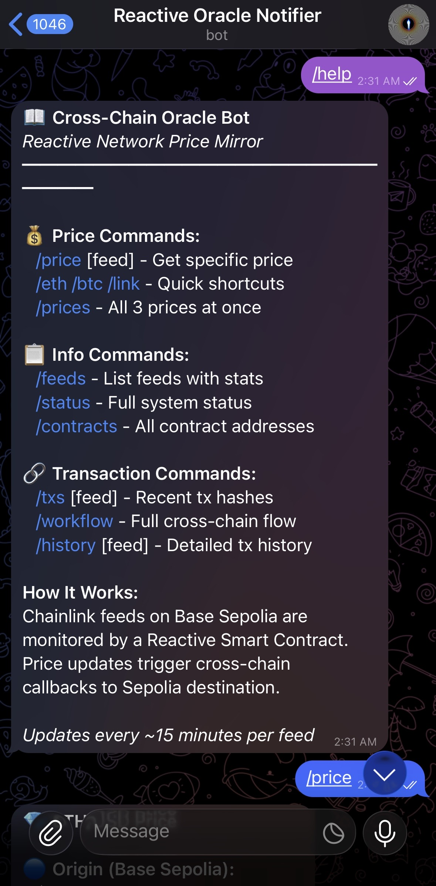
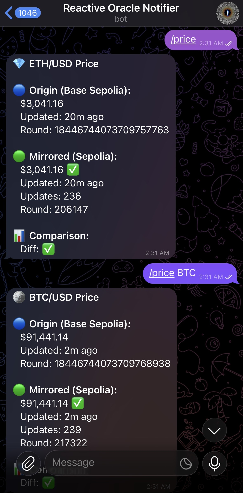
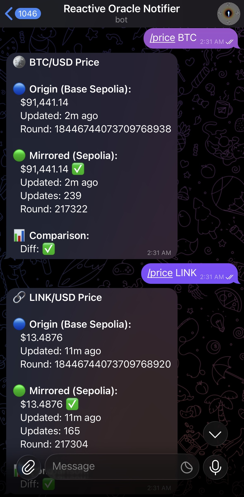
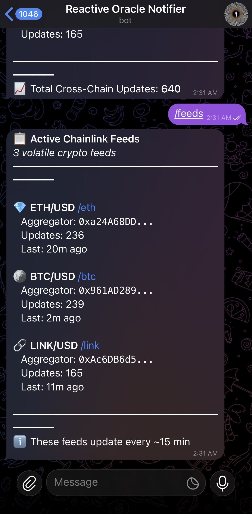

# 🤖 Telegram Bot Documentation

## Cross-Chain Price Oracle Telegram Bot

A real-time monitoring bot for the Reactive Network Cross-Chain Price Oracle system with **Auto-Refill Support**. Monitor ETH/USD, BTC/USD, and LINK/USD prices as they're mirrored from Base Sepolia to Ethereum Sepolia.

---

## 🚀 Quick Start

### Prerequisites
```bash
# Ensure environment variables are set in .env
TELEGRAM_BOT_TOKEN=your_bot_token_from_botfather
TELEGRAM_CHAT_ID=your_chat_id
PRIVATE_KEY=your_private_key  # Required for auto-refill
```

### Start the Bot

**With Auto-Refill (Recommended):**
```bash
npm run bot:autorefill
```

**Basic Bot (No Auto-Refill):**
```bash
npm run bot
```

### Expected Output (Auto-Refill Version)
```
╔═══════════════════════════════════════════════════════════════╗
║  CROSS-CHAIN ORACLE BOT - WITH AUTO-REFILL                    ║
╚═══════════════════════════════════════════════════════════════╝

📊 System Status:
   Wallet: 0xDDe9D31a31d6763612C7f535f51E5dC9f830682e
   Wallet REACT: 54.59594516
   Wallet SepETH: 2.355605410029114057
   Total Updates: 700

📋 RSC Status:
   ✅ Multi-Feed RSC: 4.9491386 REACT
   ✅ V2 RSC: 4.9818204 REACT
   ✅ Original RSC: 4.989007 REACT

🔄 Auto-Refill: ENABLED
   Check interval: 60s
   RSC min balance: 2 REACT

👀 Listening for commands... (Ctrl+C to stop)
```

---

## 📱 Bot Screenshots

### All Prices (`/prices`)

*Live prices for ETH/USD, BTC/USD, and LINK/USD with update counts and status*

### Single Feed Price (`/eth`)

*Detailed ETH/USD price with round ID, update count, and origin aggregator info*

### System Status (`/status`)

*Full system status including networks, statistics, and per-feed updates*

### Transaction Hashes (`/txs`)

*Recent transaction hashes across all 3 chains with explorer links*

### Cross-Chain Workflow (`/workflow`)

*Step-by-step cross-chain flow from origin to destination*

### Contract Addresses (`/contracts`)

*All deployed contract addresses on Reactive, Sepolia, and Base Sepolia*

---

## 📋 Available Commands

### Price Commands

| Command | Aliases | Description |
|---------|---------|-------------|
| `/price` | `/prices`, `/p` | Get all 3 feed prices |
| `/price ETH` | `/eth` | Get ETH/USD price |
| `/price BTC` | `/btc` | Get BTC/USD price |
| `/price LINK` | `/link` | Get LINK/USD price |

### Balance & Refill Commands (NEW!)

| Command | Aliases | Description |
|---------|---------|-------------|
| `/balance` | `/bal` | Check wallet and RSC balances |
| `/refill` | `/fund` | Manually trigger RSC refill |
| `/autorefill` | `/auto` | Toggle auto-refill on/off |

### System Commands

| Command | Aliases | Description |
|---------|---------|-------------|
| `/status` | `/s` | Full system status with all metrics |
| `/feeds` | `/f` | List all active feeds with update counts |
| `/txs` | `/transactions` | Recent transaction hashes (all 3 chains) |
| `/workflow` | `/flow`, `/w` | Cross-chain workflow explanation |
| `/contracts` | `/c` | All deployed contract addresses |
| `/history` | `/h` | Historical update statistics |
| `/help` | `/start` | List all available commands |

---

## 🔄 Auto-Refill Feature

The enhanced Telegram bot includes automatic balance monitoring and RSC refilling capabilities.

### How It Works

1. **Continuous Monitoring**: Checks RSC balances every 60 seconds
2. **Auto-Convert**: When wallet REACT is low, automatically converts SepETH to REACT via the official faucet (1:100 ratio)
3. **Auto-Fund**: When RSC balance drops below threshold, sends REACT and covers debt
4. **Telegram Alerts**: Sends notifications when actions are taken

### Configuration

| Parameter | Default | Description |
|-----------|---------|-------------|
| `RSC_MIN_BALANCE` | 2 REACT | Alert/refill threshold |
| `RSC_REFILL_TARGET` | 5 REACT | Target balance after refill |
| `WALLET_MIN_REACT` | 15 REACT | Auto-convert trigger |
| `SEPETH_CONVERT_AMOUNT` | 0.3 SepETH | Amount to convert (= 30 REACT) |
| `CHECK_INTERVAL` | 60 seconds | Monitoring frequency |

### Sample Auto-Refill Alerts

**Low Balance Alert:**
```
⚠️ LOW BALANCE ALERT

Wallet REACT: 10.5
Wallet SepETH: 2.3

Please fund wallet manually!
```

**Auto-Convert Triggered:**
```
💱 Auto-Convert Triggered

Converted 0.3 SepETH to REACT
TX: 0x41467bf1d9fee76b7...

⏳ Waiting for REACT to arrive...
```

**Auto-Refill Complete:**
```
🔧 Auto-Refill: Multi-Feed RSC

Fund TX: 0x9b2d52ea0ee0d55a...
Cover TX: 0x79412e86861...

✅ RSC is now active!
```

### `/balance` - Balance Report
```
💰 Balance Report
━━━━━━━━━━━━━━━━━━━━━━━━

👛 Wallet:
   SepETH: 2.3556
   REACT: 54.5959

📋 RSC Contracts:

🟢 Multi-Feed RSC
   Balance: 4.9491 REACT
   Status: ACTIVE

🟢 V2 RSC
   Balance: 4.9818 REACT
   Status: ACTIVE

🟢 Original RSC
   Balance: 4.9890 REACT
   Status: ACTIVE

━━━━━━━━━━━━━━━━━━━━━━━━
🔄 Auto-Refill: ✅ ON
⚙️ Min Balance: 2 REACT
```

### `/refill` - Manual Refill
```
🔧 Manual Refill Complete

✅ Multi-Feed RSC
   Fund: 0x9b2d52ea0ee0...
   Cover: 0x79412e868614...

✅ Refilled 1 RSC(s)
```

### `/autorefill` - Toggle Auto-Refill
```
🔄 Auto-Refill Enabled

Auto-refill is now ✅ ON

RSCs will be automatically funded when
balance drops below 2 REACT.
```

---

## 📱 Sample Responses

### `/prices` - All Prices
```
📊 CROSS-CHAIN ORACLE PRICES
━━━━━━━━━━━━━━━━━━━━━━━━━━━━

💎 ETH/USD
   Price: $3,041.16
   Updates: 236
   Last: 18m ago
   Status: ✅ LIVE

🪙 BTC/USD
   Price: $91,441.14
   Updates: 239
   Last: 2m ago
   Status: ✅ LIVE

🔗 LINK/USD
   Price: $13.49
   Updates: 165
   Last: 9m ago
   Status: ✅ LIVE

━━━━━━━━━━━━━━━━━━━━━━━━━━━━
📈 Total Updates: 640
🔄 System: ACTIVE
```

---

### `/eth` - Single Feed Price
```
💎 ETH/USD PRICE
━━━━━━━━━━━━━━━━━━━━━━━━━━━━

💵 Price: $3,041.16

📊 Statistics:
   • Round ID: 18446744073709617381
   • Total Updates: 236
   • Last Update: 18m ago

🔗 Origin: Base Sepolia
   • Aggregator: 0xa24A68DD...
   • Decimals: 8

✅ Status: LIVE
━━━━━━━━━━━━━━━━━━━━━━━━━━━━
```

---

### `/status` - Full System Status
```
⚙️ SYSTEM STATUS
━━━━━━━━━━━━━━━━━━━━━━━━━━━━

🌐 Networks:
   • Origin: Base Sepolia (84532)
   • Reactive: Lasna (5318007)
   • Destination: Sepolia (11155111)

📊 Oracle Statistics:
   • Total Cross-Chain Updates: 640
   • Active Feeds: 3
   • RSC Status: ✅ ACTIVE
   • RSC Balance: 0.000799 REACT

💰 Destination Contract:
   • Address: 0x889c32f4...
   • Debt: 0.0 ETH
   • Reserves: 0.109 ETH

📈 Feed Status:
   • ETH/USD: ✅ 236 updates
   • BTC/USD: ✅ 239 updates
   • LINK/USD: ✅ 165 updates

━━━━━━━━━━━━━━━━━━━━━━━━━━━━
🕐 Uptime: Continuous since deployment
```

---

### `/txs` - Transaction Hashes
```
🔗 RECENT TRANSACTIONS
━━━━━━━━━━━━━━━━━━━━━━━━━━━━

📤 ORIGIN (Base Sepolia):
   ETH/USD: 0x205f180a...
   ↗️ basescan.org/tx/0x205f...

   BTC/USD: 0x3a8b2c1d...
   ↗️ basescan.org/tx/0x3a8b...

   LINK/USD: 0x7f9e4b2a...
   ↗️ basescan.org/tx/0x7f9e...

⚡ REACTIVE (Lasna):
   0x45c06495...
   ↗️ reactscan.net/tx/0x45c0...

   0x17d81f88...
   ↗️ reactscan.net/tx/0x17d8...

📥 DESTINATION (Sepolia):
   0x9c577f91...
   ↗️ etherscan.io/tx/0x9c57...

━━━━━━━━━━━━━━━━━━━━━━━━━━━━
📋 Use /workflow for full flow
```

---

### `/workflow` - Cross-Chain Workflow
```
🔄 CROSS-CHAIN WORKFLOW
━━━━━━━━━━━━━━━━━━━━━━━━━━━━

STEP 1: ORIGIN EVENT
━━━━━━━━━━━━━━━━━━━━
📍 Chain: Base Sepolia (84532)
📝 Event: AnswerUpdated(price, roundId, timestamp)
🎯 Emitter: Chainlink Aggregators

   ETH/USD: 0xa24A68DD788e1D7eb4CA...
   BTC/USD: 0x961AD289351459A45fC9...
   LINK/USD: 0xAc6DB6d5538Cd07f58af...

                    ⬇️

STEP 2: REACTIVE PROCESSING
━━━━━━━━━━━━━━━━━━━━━━━━━━━
📍 Chain: Reactive Lasna (5318007)
📝 Contract: MultiFeedMirrorRCv2
🎯 Address: 0x70c6c95D4F75eE019Fa2c...

   Actions:
   ✅ Subscribe to AnswerUpdated events
   ✅ Validate price data
   ✅ Deduplicate by roundId per feed
   ✅ Add feed identifier + decimals
   ✅ Emit Callback to destination

                    ⬇️

STEP 3: DESTINATION UPDATE
━━━━━━━━━━━━━━━━━━━━━━━━━━━
📍 Chain: Ethereum Sepolia (11155111)
📝 Contract: MultiFeedDestinationV2
🎯 Address: 0x889c32f46E273fBd0d5B18...

   Via Callback Proxy:
   0xc9f36411C9897e7F959D99ffca2a0Ba...

   Actions:
   ✅ Validate callback sender
   ✅ Validate RVM ID (authorized RSC)
   ✅ Validate feed source & decimals
   ✅ Store price with monotonicity
   ✅ Emit FeedUpdated event

━━━━━━━━━━━━━━━━━━━━━━━━━━━━
⏱️ Latency: ~30 seconds end-to-end
🔐 Security: Fully trustless
```

---

### `/contracts` - Contract Addresses
```
📋 DEPLOYED CONTRACTS
━━━━━━━━━━━━━━━━━━━━━━━━━━━━

🔵 REACTIVE LASNA (5318007)
━━━━━━━━━━━━━━━━━━━━━━━━━━━
MultiFeedMirrorRCv2:
0x70c6c95D4F75eE019Fa2c163519263a11AaC70f5
↗️ reactscan.net/address/0x70c6...

🟢 ETHEREUM SEPOLIA (11155111)
━━━━━━━━━━━━━━━━━━━━━━━━━━━
MultiFeedDestinationV2:
0x889c32f46E273fBd0d5B1806F3f1286010cD73B3
↗️ sepolia.etherscan.io/address/0x889c...

Callback Proxy:
0xc9f36411C9897e7F959D99ffca2a0Ba7ee0D7bDA
↗️ sepolia.etherscan.io/address/0xc9f3...

🔴 BASE SEPOLIA (84532)
━━━━━━━━━━━━━━━━━━━━━━━━━━━
Chainlink ETH/USD Aggregator:
0xa24A68DD788e1D7eb4CA517765CFb2b7e217e7a3
↗️ sepolia.basescan.org/address/0xa24A...

Chainlink BTC/USD Aggregator:
0x961AD289351459A45fC90884eF3AB0278ea95DDE
↗️ sepolia.basescan.org/address/0x961A...

Chainlink LINK/USD Aggregator:
0xAc6DB6d5538Cd07f58afee9dA736ce192119017B
↗️ sepolia.basescan.org/address/0xAc6D...

━━━━━━━━━━━━━━━━━━━━━━━━━━━━
```

---

### `/help` - Help Menu
```
🤖 CROSS-CHAIN ORACLE BOT
━━━━━━━━━━━━━━━━━━━━━━━━━━━━

📈 PRICE COMMANDS
   /prices     - All 3 feed prices
   /eth        - ETH/USD price
   /btc        - BTC/USD price
   /link       - LINK/USD price

📊 STATUS COMMANDS
   /status     - Full system status
   /feeds      - Feed list with stats
   /history    - Update history

🔗 TRANSACTION COMMANDS
   /txs        - Recent tx hashes
   /workflow   - Cross-chain flow
   /contracts  - Contract addresses

ℹ️ OTHER
   /help       - This menu

━━━━━━━━━━━━━━━━━━━━━━━━━━━━
💡 Tip: Prices update automatically
   when Chainlink feeds change!
```

---

## 🔧 Configuration

### Environment Variables

| Variable | Required | Description |
|----------|----------|-------------|
| `TELEGRAM_BOT_TOKEN` | ✅ | Bot token from @BotFather |
| `TELEGRAM_CHAT_ID` | ✅ | Your Telegram chat ID |
| `PRIVATE_KEY` | ✅ (for auto-refill) | Wallet private key for transactions |
| `SEPOLIA_RPC_URL` | Optional | Sepolia RPC (has fallback) |
| `REACTIVE_RPC_URL` | Optional | Reactive RPC (has fallback) |
| `BASE_SEPOLIA_RPC_URL` | Optional | Base Sepolia RPC (has fallback) |

### NPM Scripts

```bash
# With auto-refill (recommended for production)
npm run bot:autorefill

# Basic bot (no auto-refill)
npm run bot

# Check all balances
npm run check:balance

# Manual fund all RSCs
npm run fund:rscs

# Standalone auto-refill service (no Telegram)
npm run auto:refill
```

### Getting Bot Token
1. Open Telegram and search for `@BotFather`
2. Send `/newbot` and follow prompts
3. Copy the token provided

### Getting Chat ID
1. Start a chat with your new bot
2. Send any message
3. Visit: `https://api.telegram.org/bot<TOKEN>/getUpdates`
4. Find `"chat":{"id":123456789}` - that's your chat ID

---

## 🛠️ Troubleshooting

### Bot Not Responding
1. Check `TELEGRAM_BOT_TOKEN` is correct
2. Ensure you've started a chat with the bot
3. Verify `TELEGRAM_CHAT_ID` matches your chat

### Stale Prices
Prices are mirrored from Chainlink which updates based on:
- Price deviation threshold (~0.5-1%)
- Heartbeat interval (1 hour on testnets)

If prices haven't updated, the origin feed likely hasn't changed.

### Connection Errors
```bash
# Check RPC connectivity
curl -X POST https://eth-sepolia.g.alchemy.com/v2/YOUR_KEY \
  -H "Content-Type: application/json" \
  -d '{"jsonrpc":"2.0","method":"eth_blockNumber","params":[],"id":1}'
```

---

## 📊 Metrics & Monitoring

The bot tracks several metrics:
- **Total Updates**: Cross-chain callbacks delivered
- **Per-Feed Updates**: Updates per price feed
- **Last Update Time**: Freshness of each feed
- **RSC Balance**: Reactive contract balance
- **Destination Debt**: Outstanding callback fees

---

## 🔒 Security Notes

- Never share your `TELEGRAM_BOT_TOKEN`
- The bot only reads blockchain data (no private keys needed)
- All data is fetched from public RPCs
- No sensitive information is stored

---

## 📞 Support

- **Reactive Network Docs**: https://dev.reactive.network/
- **Telegram Bot API**: https://core.telegram.org/bots/api
- **Project Repository**: https://github.com/guglxni/reactive-bounty-1

---

*Part of the Reactive Cross-Chain Oracle Bounty Submission - November 2025*
